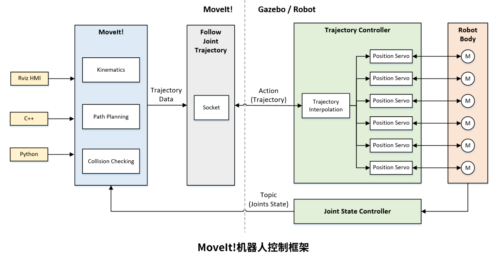

```

-- ur_moveit_config 
    基本上由moveit_setup_assistant生成，只做了少部分修改
    如，给生成的urdf文件添加一个固定的world坐标系到base_link的父级
-- ur3
    保存ur3_robot的urdf定义
-- ur3_gazebo
    调用ur_moveit_config内的文件进行gazebo和rviz仿真
-- ur_program_move
    使用python代码来控制机械臂运动，通过关节空间的正运动学、逆运动学，或者笛卡尔空间
    -- scripts
        -- moveit_forward_k.py  使用关节空间正向运动学
        -- moveit_inverse_k.py  使用关节空间逆向运动学
        -- moveit_cartesian.py  使用笛卡尔空间
        -- moveit_attached_object_demo.py  给空间内添加一个避障物体，机械臂运动过程中会进行自主避障
```



重点：
1. gazebo_status.launch负责加载关节状态控制器joint_state_controller和robot_state_publisher
2. trajectory_controller.launch负责加载关节轨迹控制器joint_trajectory_controller
3. moveit_planning_execution.launch调用moveit功能进行轨迹规划